# Pure Python Transformer 🐍

A complete implementation of the Transformer architecture in pure Python/NumPy - no PyTorch, TensorFlow, or JAX required! Born from a lifelong passion for machine learning and grounded in my master's thesis work on FPGA-based neural networks, this project represents my journey to deeply understand transformer architecture from the ground up.

## 🌟 Features

- **100% Pure Python**: No deep learning frameworks - just NumPy for numerical computation
- **Complete Implementation**: Every component built from scratch with full forward/backward passes
- **Working Training & Inference**: Successfully trains and generates text
- **Clean Weight Separation**: Model architecture separate from trained parameters
- **Educational Focus**: Deeply commented code with mathematical explanations

## 🚀 Quick Start

### Installation

```bash
# Clone the repository
git clone https://github.com/yourusername/positron-transformer.git
cd positron-transformer

# Create virtual environment (optional but recommended)
python3 -m venv venv
source venv/bin/activate  # On Windows: venv\Scripts\activate

# Install dependencies (only NumPy and matplotlib!)
pip install numpy matplotlib
```

### Train Your First Model

```bash
# Train a small transformer on sample text (takes ~5 minutes)
python examples/train_simple.py
```

This will:
- Train for 50 epochs on sample text
- Save model checkpoint with separated config/weights
- Save tokenizer vocabulary
- Generate sample text to test
- Create training loss plot

Expected output:
```
Training completed in 336.82 seconds
Final training loss: 2.3444
Generated: 'Once upon a timeilliuos t wonheag wo,taT td t wo w...'
✅ Checkpoint saved to ./
   - Config: simple_model_config.json
   - Weights: simple_model_weights.npz
```

### Generate Text

```bash
# Generate text with your trained model
python examples/generate_text.py "Once upon a time"

# Try different temperatures for creativity
python examples/generate_text.py "The wizard" --temperature 0.5  # More conservative
python examples/generate_text.py "The wizard" --temperature 1.2  # More creative
```

## 🏗️ Architecture: From Neurons to Attention

Having worked with neural networks in hardware, I find it fascinating how transformers evolved from traditional architectures:

```
Traditional MLP (my FPGA work):
Input → Linear → Activation → Linear → Output
  ↓ (Fixed weights, sequential processing)

Transformer Innovation:
Input → Embedding → Attention → FFN → Output
  ↓ (Dynamic weights, parallel processing)
```

## 🔄 Training Workflow

Here's exactly what happens when you run `python examples/train_simple.py`:

```mermaid
graph TD
    A[👤 You run train_simple.py] --> B[📋 Load config from model_config.py]
    B --> C[🔤 Create CharacterTokenizer from tokenizer_py.py]
    C --> D[📝 Train tokenizer on data/sample/tiny_stories.txt]
    D --> E[🧠 Create Transformer from transformer.py]

    E --> F[🏗️ Transformer initializes components:]
    F --> F1[📦 TransformerEmbedding<br/>embeddings_py.py]
    F --> F2[🔍 Multi-Head Attention<br/>attention_py.py]
    F --> F3[🔀 Feed-Forward Network<br/>feedforward_py.py]
    F --> F4[⚖️ Layer Normalization<br/>layer_norm_py.py]

    F1 --> G[🎯 Call train_model from training.py]
    F2 --> G
    F3 --> G
    F4 --> G

    G --> H[🔄 Training Loop: 20 epochs default]
    H --> H1[➡️ Forward pass through all components]
    H --> H2[⬅️ Backward pass computing gradients]
    H --> H3[📈 Adam optimizer updates weights]
    H --> H4[📊 Log loss every 10 epochs]

    H --> I[💾 Save model directly]
    I --> I1[📄 simple_model.npz<br/>Complete model state]
    I --> I2[📚 simple_tokenizer.vocab<br/>Vocabulary mapping]

    I --> J[✨ Generate sample text]
    J --> K[📈 Save training_loss.png]
    K --> L[✅ Complete! Ready for generation]
```



### Component Flow During Training

```
📥 Input: "Once upon a time..."
    ↓
🔤 CharacterTokenizer: text → [15, 25, 3, 8, ...]
    ↓
📦 TransformerEmbedding: tokens → dense vectors + positions
    ↓
🔄 TransformerBlock 1:
    ├─ 🔍 Multi-Head Attention (self-attention)
    ├─ ⚖️ Layer Norm + Residual
    ├─ 🔀 Feed-Forward Network  
    └─ ⚖️ Layer Norm + Residual
    ↓
🔄 TransformerBlock 2: (same structure)
    ↓
⚖️ Final Layer Norm
    ↓
🎯 Output Projection: vectors → vocabulary logits
    ↓
📊 Loss Computation: compare with target tokens
    ↓
⬅️ Backward Pass: gradients flow back through all components
    ↓
📈 Adam Optimizer: update all weights
    ↓
🔄 Repeat for 50 epochs...
```

### Core Components Implemented:

1. **Tokenization** (`tokenizer_py.py`)
   - Character-level tokenizer (simplest, used in training)
   - Word-level tokenizer 
   - BPE tokenizer for subword units
   
2. **Embeddings** (`embeddings_py.py`)
   - Token embeddings with gradient computation
   - Sinusoidal positional encoding (no training needed)
   - Learnable positional embeddings option
   
3. **Attention** (`attention_py.py`)
   - Scaled dot-product attention
   - Multi-head self-attention
   - Full backward pass implementation
   
4. **Feed-Forward** (`feedforward_py.py`)
   - Two-layer MLP with activation functions
   - GELU, ReLU, Swish support
   - Dropout for regularization
   
5. **Layer Norm** (`layer_norm_py.py`)
   - Pre-norm architecture
   - Numerical stability with epsilon
   - Learnable scale/shift parameters
   
6. **Complete Model** (`transformer.py`)
   - Autoregressive language model
   - Residual connections
   - Text generation with temperature sampling

## 🔬 What Makes This Special

- **Mathematical Transparency**: Every operation implemented from scratch - no hidden abstractions
- **Numerical Precision**: Careful attention to IEEE 754 floating-point for stable computations  
- **Hardware Perspective**: Architecture designed with potential FPGA acceleration in mind
- **Educational Value**: Extensive comments explaining not just "what" but "why"
- **Learning Focus**: Built to understand how transformers really work under the hood

## 💾 Checkpoint System

Our implementation cleanly separates model architecture from weights:

```python
from checkpoint import CheckpointManager, ModelBuilder

# Save model with separated config and weights
CheckpointManager.save(model, './checkpoints', 'my_model')
# Creates:
#   my_model_config.json   - Architecture definition
#   my_model_weights.npz   - Trained parameters

# Load weights into existing model
CheckpointManager.load(model, './checkpoints', 'my_model')

# Or build model directly from checkpoint
model = ModelBuilder.from_checkpoint('./checkpoints', 'my_model')
```

This separation enables:
- Version control without large weight files
- Easy model sharing and distribution
- Architecture experimentation with same weights
- Future export to other frameworks

## 🧮 Technical Highlights

### Drawing from Hardware Neural Network Experience:
- **Numerical Stability**: All operations handle edge cases (overflow, underflow, NaN)
- **Modular Design**: Clean component separation for easy testing and modification  
- **Memory Efficiency**: Vectorized operations throughout
- **Gradient Precision**: Careful handling of backpropagation mathematics

### Transformer-Specific Innovations:
- **Scaled Dot-Product Attention**: The core mechanism that enables transformers
- **Multi-Head Attention**: Parallel attention in different representation subspaces
- **Positional Encoding**: Giving the model a sense of sequence order
- **Layer Normalization**: Training stability for deep networks

## 📊 From My FPGA Background to Transformers

| My FPGA Neural Network Experience | This Transformer Journey |
|-----------------------------------|---------------------------|
| Fixed weight matrices | Dynamic attention weights |
| Sequential processing | Parallel attention heads |
| Hardware constraints | Software flexibility |
| 160MHz operation | NumPy vectorization |
| IEEE 754 precision focus | Numerical stability principles |

## 🎓 My Learning Journey

This project represents a personal evolution that I'm excited to share - from my master's thesis on FPGA neural networks to understanding modern transformers:

1. **Understanding**: Started with MLPs during my thesis, now exploring the magic of attention mechanisms
2. **Implementation**: From VHDL/Verilog hardware design to Python/NumPy mathematical beauty
3. **Scale**: From small FPGA networks to the foundations of language models
4. **Impact**: From academic research to technology that's reshaping our world in 2025

## 💡 Why Pure Python + NumPy?

**Complete Control**: Understand every operation, optimize every detail
**Educational Value**: See exactly how transformers work mathematically
**Hardware Preparation**: Clean foundation for potential FPGA acceleration
**Personal Satisfaction**: The joy of building complex systems from simple parts

## 🔮 Future Directions

- **Performance Optimization**: Apply insights from my hardware experience for acceleration
- **Advanced Architectures**: Implement modern transformer variants
- **Hardware Acceleration**: Explore FPGA implementation of key components
- **Educational Resources**: Share knowledge bridging hardware and software neural networks

## 🙏 A Personal Note

This project is close to my heart - it combines my lifelong passion for machine learning with the curiosity to understand transformers at their deepest level. Coming from my master's thesis work on FPGA neural networks, I've always been fascinated by the mathematical elegance of these systems. Building this transformer from scratch felt like the natural next step in my learning journey.

Every component here is lovingly implemented from scratch, not just to show how it works, but to truly understand the beautiful mathematics flowing through attention mechanisms and gradient calculations.

## 📁 Project Structure

```
positron-transformer/
├── README.md                 # This file
├── transformer.py            # Main transformer model
├── attention_py.py          # Multi-head attention implementation
├── feedforward_py.py        # Feed-forward networks
├── layer_norm_py.py         # Layer normalization
├── embeddings_py.py         # Token & positional embeddings
├── tokenizer_py.py          # Tokenizer implementations
├── training.py              # Training loop & Adam optimizer
├── checkpoint.py            # Model checkpointing system
├── config_py.py             # Model configurations
│
├── examples/
│   ├── train_simple.py     # Simple training script
│   ├── generate_text.py    # Text generation script
│   └── benchmark.py         # Performance benchmarking
│
└── tests/
    └── test_components.py   # Unit tests for all components
```

## 📊 Training Results

After 20 epochs of training on sample text (default configuration):
- **Training Loss**: Typically reduces by 60-80% from initial loss
- **Training Time**: ~2-3 minutes on M1/M2 Mac (20 epochs), ~10-15 minutes (200 epochs)
- **Generated Text**: Learns character patterns, basic word boundaries, and text structure

### Training Loss Curve

*Training loss curve showing convergence over epochs*

You can also run longer training:
```bash
# Train for 200 epochs for better results
python examples/train_simple.py --long-training

# Use different model sizes
python examples/train_simple.py --config small    # Faster training
python examples/train_simple.py --config improved # Better quality (default)
```

Example generation with improved model (200 epochs):
```
Prompt: "Once upon a time"
Generated: "Once upon a time there was a little girl who loved to play..."
```

## 🛠️ Advanced Usage

### Custom Model Architecture

```python
from model_config import get_model_config, IMPROVED_MODEL_CONFIG
from transformer import Transformer

# Use predefined configurations
config = get_model_config('improved')  # or 'small'

# Or create a custom configuration
config = IMPROVED_MODEL_CONFIG.copy()
config.update({
    'vocab_size': 5000,
    'embed_dim': 512,
    'num_heads': 16,
    'num_layers': 6,
    'ff_dim': 2048,
    'max_seq_len': 256
})

model = Transformer(config)
print(f"Model created with {len(config)} configuration parameters")
```

### Different Tokenizers

```python
# Character-level (simplest, used by default)
from tokenizer_py import CharacterTokenizer
tokenizer = CharacterTokenizer()

# Word-level tokenizer
from tokenizer_py import WordTokenizer
tokenizer = WordTokenizer(max_vocab_size=10000)

# Simple BPE tokenizer (built-in implementation)
from tokenizer_py import SimpleBPETokenizer
tokenizer = SimpleBPETokenizer(vocab_size=8000)

# Advanced BPE tokenizer (separate implementation)
from subword_tokenizer import BPETokenizer
tokenizer = BPETokenizer(vocab_size=8000)
```

You can also use the BPE training example:
```bash
# Train a BPE model and generate text
python examples/train_bpe.py
python examples/generate_bpe.py "Once upon a time"
```

### Custom Training

```python
from training import train_model
from model_config import DEFAULT_TRAINING_CONFIG, BPE_TRAINING_CONFIG

# Use predefined training configurations
train_config = DEFAULT_TRAINING_CONFIG.copy()  # 200 epochs
# or
train_config = BPE_TRAINING_CONFIG.copy()      # Optimized for BPE

# Customize training parameters
train_config.update({
    'learning_rate': 2e-3,
    'batch_size': 32,
    'num_epochs': 100,
    'seq_len': 64
})

# Train model
metrics = train_model(model, tokenizer, sample_text, train_config)
```

## 🎓 Educational Resources

Each component includes extensive documentation:

- **Mathematical Derivations**: Full forward/backward pass mathematics
- **Implementation Notes**: Why certain numerical tricks are used
- **Performance Considerations**: Time/space complexity analysis
- **Hardware Insights**: Notes on potential FPGA acceleration

## 🤝 Contributing

Contributions welcome! Areas of interest:
- Performance optimizations
- Additional optimizers (RMSprop, AdamW)
- Attention visualizations
- More tokenizer options
- Training utilities

## 📚 References

Key papers that informed this implementation:
- [Attention Is All You Need](https://arxiv.org/abs/1706.03762) - The original transformer paper
- [Layer Normalization](https://arxiv.org/abs/1607.06450) - Training stability
- [GELU Activation](https://arxiv.org/abs/1606.08415) - Better than ReLU for transformers

## 🙏 Acknowledgments

- The NumPy team for the incredible library
- The open source ML community for knowledge sharing
- My professors who encouraged hardware/software neural network exploration

---

Built with ❤️ and mathematical rigor by someone who loves understanding how things really work.
